# KiwiFit - Fitness Workout Tracker App

A comprehensive fitness workout tracker application built with **React Native** and **Expo**, designed to help users create custom workouts, track exercises, monitor progress, and achieve their fitness goals.

---

## Overview

**KiwiFit** is a mobile fitness application that combines an extensive exercise database with intelligent tracking capabilities. Whether you're a beginner or an experienced lifter, KiwiFit provides the tools to organize your workouts, monitor your progression, and stay motivated throughout your fitness journey.

**Tech Stack:**
- React Native + Expo
- SQLite Database
- React Navigation
- React Native Chart Kit (Progress tracking)
- Gesture Handler (Drag-and-drop)

---

## App Interface Gallery

| | | | |
|---|---|---|---|
|  | 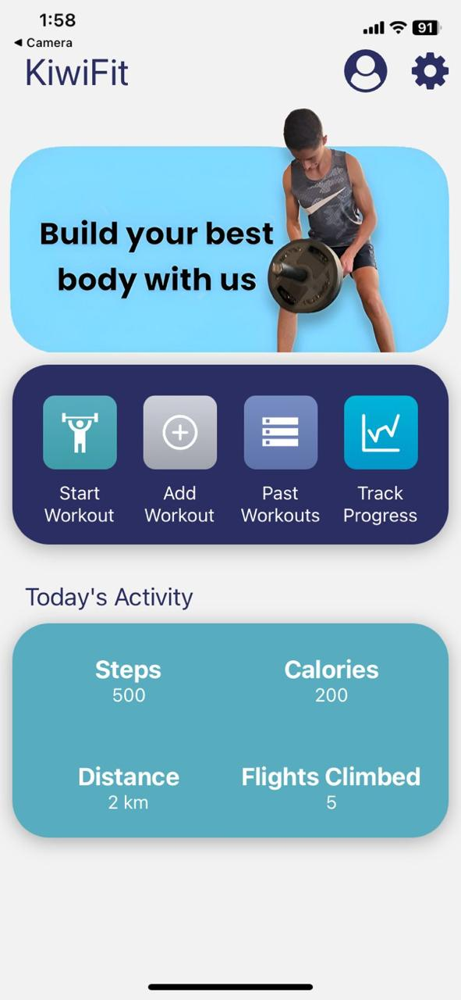 | 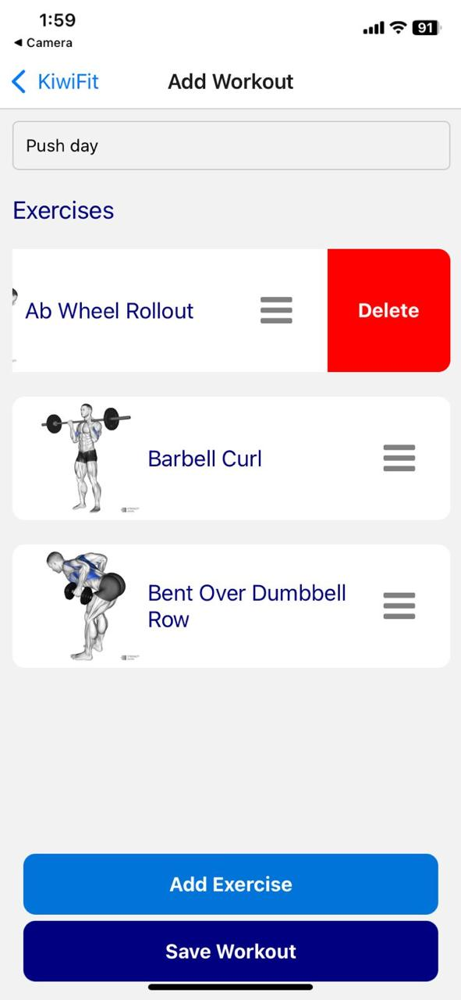 | 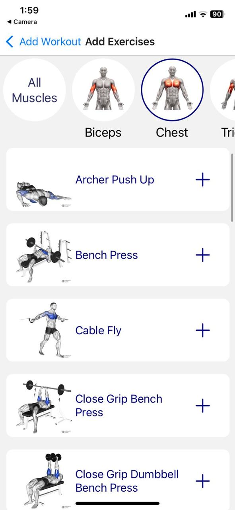 |
| 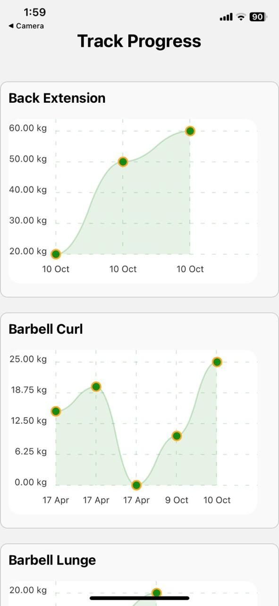 | 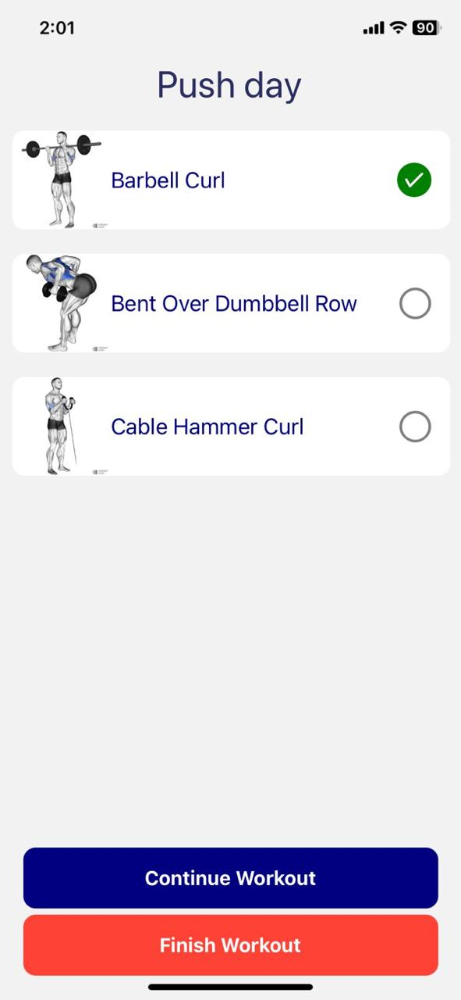 | 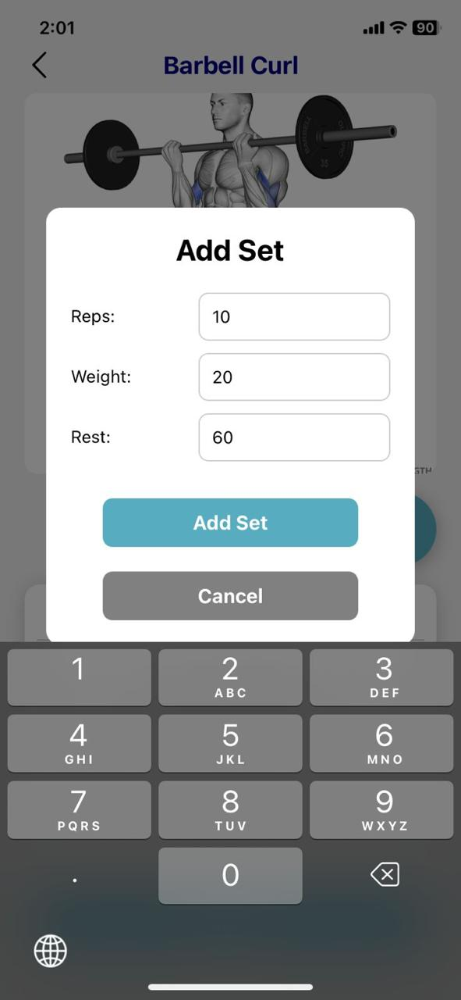 | 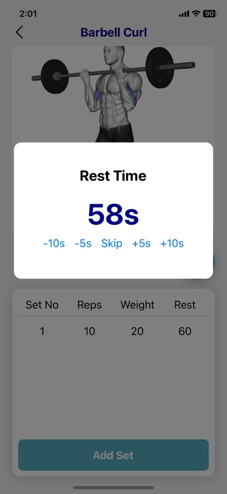 |

---

## Muscle Groups Supported

Browse exercises organized by 12 different muscle groups:

| | | | | | | | |
|---|---|---|---|---|---|---|---|
| 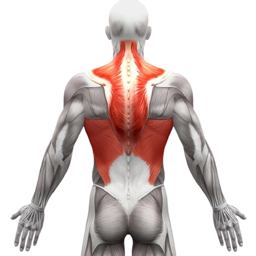 Back | 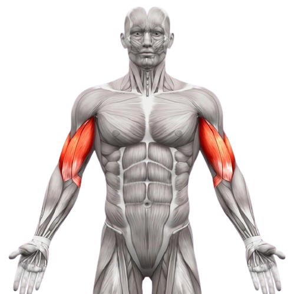 Biceps | 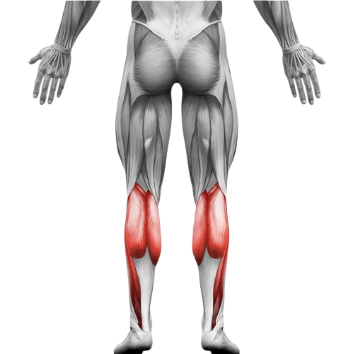 Calves | 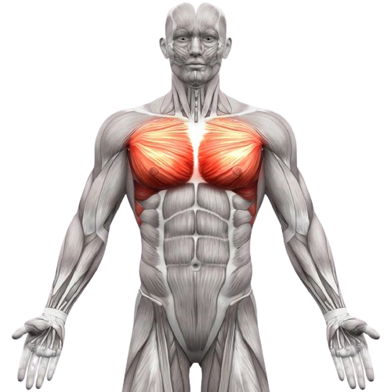 Chest |
| 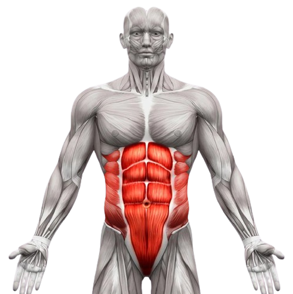 Core | 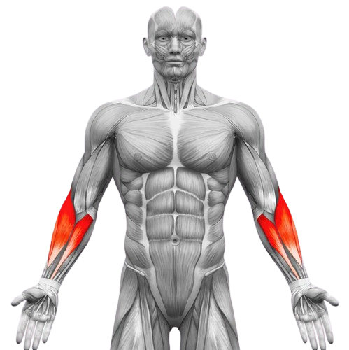 Forearms | 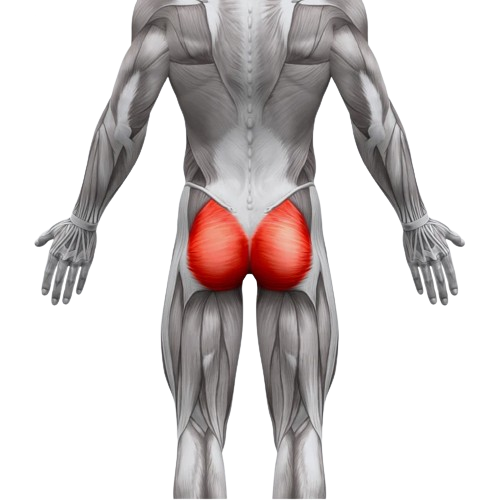 Glutes | 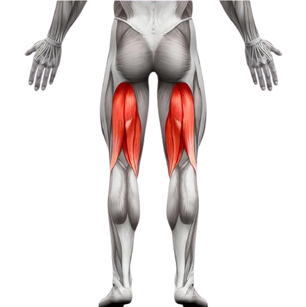 Hamstrings |
| 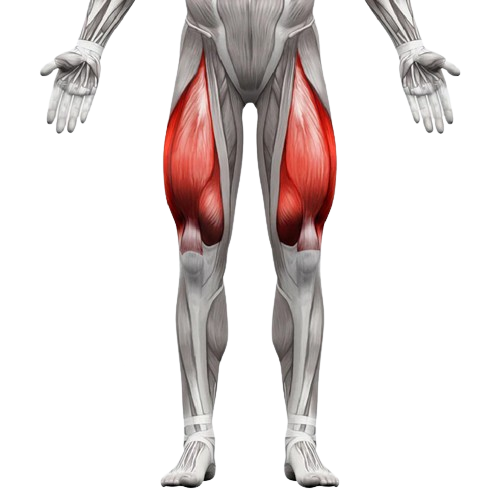 Legs | 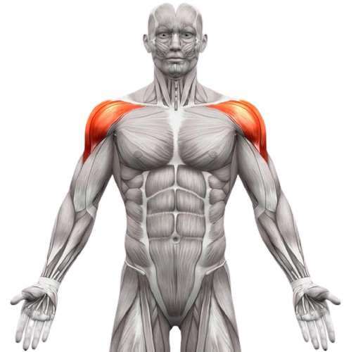 Shoulders | 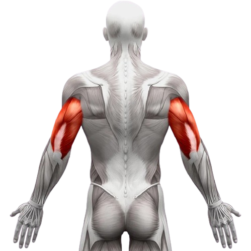 Triceps | Plus many more! |

---

## Key Features

### 1. **Workout Management**
- Create custom workout routines
- Add multiple exercises to each workout
- Drag-and-drop exercise ordering (reorder exercises effortlessly)
- Save and manage multiple workout templates
- Quick access to previously used workouts

### 2. **Exercise Browse & Selection**
- Browse 200+ exercises organized by muscle group
- Visual exercise guides with high-quality reference images
- Filter exercises by muscle group (Back, Chest, Shoulders, Legs, etc.)
- Search for specific exercises
- Easy-to-use exercise selection interface

### 3. **Active Workout Tracking**
- Start and track workouts in real-time
- Log sets, reps, and weight for each exercise
- Record rest periods between sets
- Built-in **countdown timer** for rest intervals
- Track multiple exercises per workout session
- Pause and resume workouts anytime
- Mark exercises as complete when finished

### 4. **Progress Tracking & Analytics**
- Visualize progress with interactive charts
- Track weight progression over time
- Line charts showing strength gains per exercise
- Historical data analysis
- View detailed workout history

### 5. **Workout History**
- View all past workouts with detailed breakdowns
- See exercises performed in each workout
- Review sets, reps, and weights lifted
- Track workout consistency
- Access historical workout data anytime

### 6. **Data Persistence**
- SQLite database for reliable local storage
- All workouts and progress data saved locally
- No data loss - everything synced to device database
- Fast and efficient data retrieval

### 7. **User Experience**
- Intuitive navigation with stack-based routing
- Beautiful UI with gradient backgrounds
- Responsive design for all screen sizes
- Smooth animations and transitions
- Icon-based navigation for quick access

---

## App Architecture

### Screen Structure
- **Intro Screen** - Initial onboarding
- **Home Screen** - Dashboard with active/in-progress workouts
- **Muscles Screen** - Browse exercises by muscle group
- **Add Workout Screen** - Create and configure new workouts
- **Start Workout Screen** - Select a pre-saved workout to begin
- **Workout Instance Screen** - Active workout tracking interface
- **Workout Screen** - Detailed exercise tracking with sets/reps/weight logging
- **Track Progress Screen** - Analytics and progress visualization
- **Past Workouts Screen** - Historical workout data

### State Management
- **WorkoutContext** - Global workout state management
- **ExercisesContext** - Exercise selection and management
- **ClickedContext** - UI state management

### Database Schema
- `exercise` - Exercise database with names and muscle groups
- `workout_exercise` - Mapping exercises to workouts
- `workout_instance` - Individual workout sessions
- `set_done` - Recorded sets with weight, reps, and rest data

---

## Dependencies

### Core Dependencies
```json
{
  "react": "18.2.0",
  "react-native": "0.74.3",
  "expo": "~51.0.22",
  "@react-navigation/native": "^6.1.18",
  "@react-navigation/native-stack": "^6.11.0",
  "expo-sqlite": "~14.0.5",
  "react-native-chart-kit": "^6.12.0",
  "react-native-draggable-flatlist": "^4.0.1",
  "expo-linear-gradient": "~13.0.2",
  "moment": "^2.30.1"
}
```

---

## Core Functionalities Explained

### Creating a Workout
1. Navigate to "Add Workout" screen
2. Enter workout name
3. Browse and select exercises
4. Arrange exercises in desired order using drag-and-drop
5. Save workout template

### Starting a Workout
1. Go to "Start Workout" screen
2. Select a saved workout template
3. Each exercise shows the number of exercises included
4. Press play icon to begin

### Logging Exercise Data
During an active workout:
1. View exercise information with reference image
2. Enter number of sets, reps, and weight
3. Log rest period between sets
4. Automatic countdown timer displays
5. Continue to next exercise when done
6. Finish workout when all exercises are complete

### Tracking Progress
1. Navigate to "Track Progress" screen
2. View line charts for each exercise
3. Charts display weight progression over time
4. Shows first date each weight was achieved
5. Track strength gains visually

---


